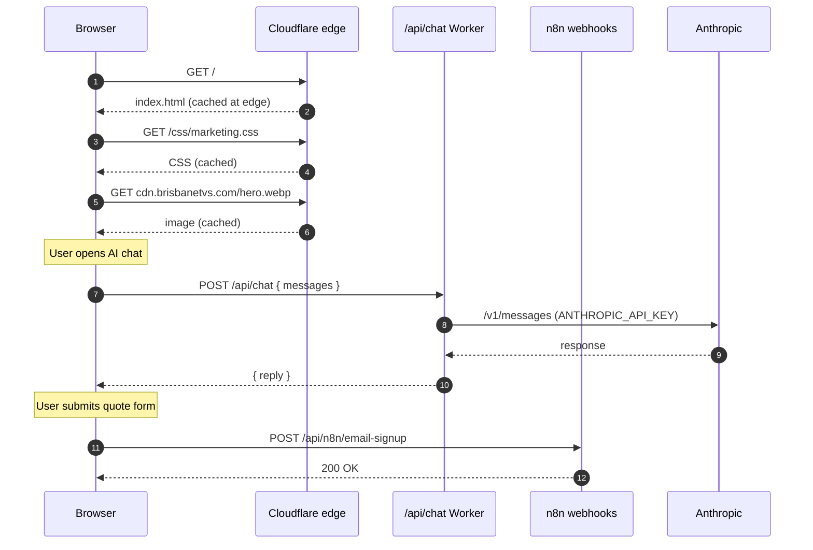
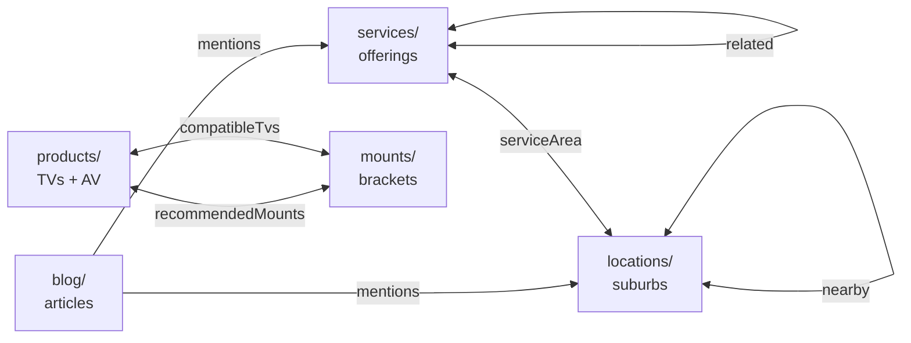
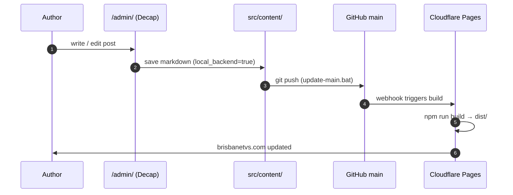
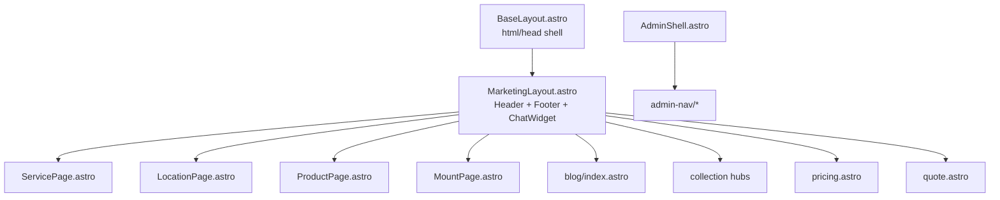
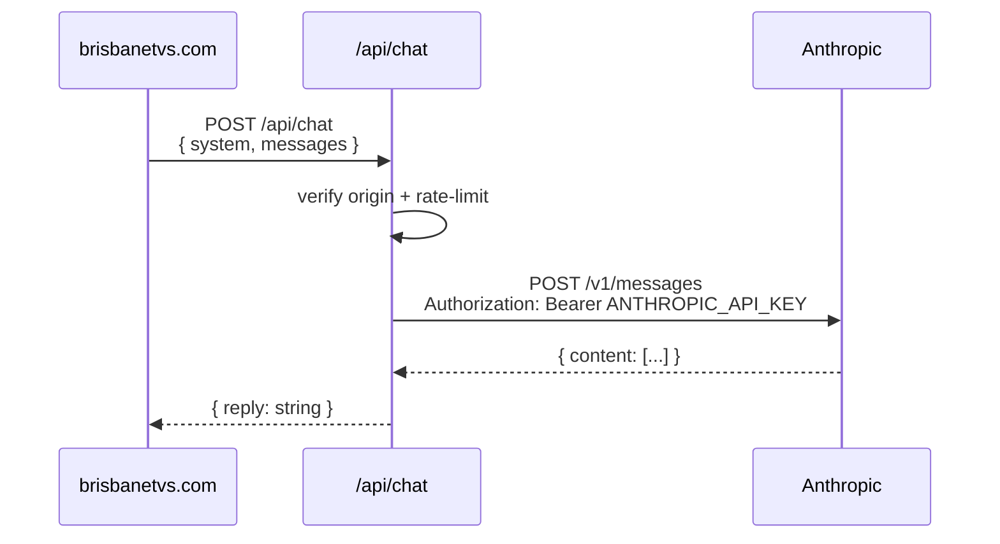
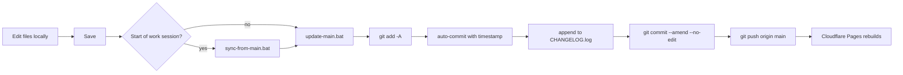

# Brisbane TVs

> The codebase for **[brisbanetvs.com](https://brisbanetvs.com)** — Brisbane's TV
> wall-mounting, cable concealment and home-theatre install service. One static
> homepage, one Astro-powered CMS-driven blog/catalogue, a handful of
> Cloudflare Workers, and a drawer full of Windows `.bat` scripts that glue
> it all together.

<p>
  <a href="https://brisbanetvs.com"></a>
  <a href="#"></a>
  <a href="#"></a>
  <a href="#"></a>
  <a href="#"></a>
  <a href="#"></a>
</p>

---

## Table of contents

1. [Clone the repo (Windows)](#clone-the-repo-windows)
2. [What this repo is](#what-this-repo-is)
3. [Architecture at a glance](#architecture-at-a-glance)
4. [Tech stack](#tech-stack)
5. [Quick start](#quick-start)
6. [Repository map](#repository-map)
7. [Content model](#content-model)
8. [Routes](#routes)
9. [Authoring content](#authoring-content)
10. [Layouts & design system](#layouts--design-system)
11. [Image pipeline](#image-pipeline)
12. [Admin dashboard](#admin-dashboard)
13. [Decap CMS setup](#decap-cms-setup)
14. [AI chat worker](#ai-chat-worker)
15. [n8n form webhooks](#n8n-form-webhooks)
16. [SEO & structured data](#seo--structured-data)
17. [Accessibility](#accessibility)
18. [Performance budgets](#performance-budgets)
19. [Build, verify, ship](#build-verify-ship)
20. [Cloudflare Pages setup](#cloudflare-pages-setup)
21. [Environment variables & secrets](#environment-variables--secrets)
22. [Scripts reference](#scripts-reference)
23. [Git workflow](#git-workflow)
24. [Troubleshooting](#troubleshooting)
25. [Release checklist](#release-checklist)
26. [Roadmap / known limitations](#roadmap--known-limitations)
27. [Documentation index](#documentation-index)
28. [Contributing](#contributing)
29. [License](#license)

---

## Clone the repo (Windows)

Brand-new Windows machine? Run these from PowerShell or Command Prompt
(either works — both commands below are identical). If you prefer the
full graphical flow, scroll to [GitHub Desktop](#option-b--github-desktop-no-command-line).

### Option A — Command line (recommended)

**1. Install the prerequisites** (skip if you already have them):

```powershell
:: Git for Windows — includes git.exe and Git Bash
winget install --id Git.Git -e

:: Node.js LTS — includes node.exe and npm
winget install --id OpenJS.NodeJS.LTS -e
```

Close and reopen your terminal after installing so `PATH` picks up the
new tools. Verify:

```powershell
git --version
node --version
npm --version
```

If `git` is still "not recognized", Git for Windows was installed but
Explorer's PATH is stale — sign out and back in, or run
`refreshenv` if you have the Chocolatey shim.

**2. Pick a folder and clone:**

```powershell
:: Move to where you want the project to live (adjust as needed)
cd %USERPROFILE%\Documents

:: Clone over HTTPS — GitHub will prompt for credentials on first push
git clone https://github.com/PrompDev/brisbanetvs.git "Brisbane TVs"

:: Enter the project
cd "Brisbane TVs"
```

If you already have an SSH key on GitHub, you can clone via SSH instead:

```powershell
git clone git@github.com:PrompDev/brisbanetvs.git "Brisbane TVs"
```

**3. Install the Astro dependencies:**

```powershell
cd astro
npm install
cd ..
```

(This only needs to be done once, and `start-astro-dev.bat` will run it
automatically the first time you launch the dev server.)

**4. Launch the dev server:**

Just double-click **`git.tools\start-astro-dev.bat`** from File
Explorer. Or from the same terminal:

```powershell
git.tools\start-astro-dev.bat
```

It opens `http://localhost:4321` in your browser when ready.

### Option B — GitHub Desktop (no command line)

1. Install [GitHub Desktop](https://desktop.github.com/) and sign in
   with the GitHub account that has access to `PrompDev/brisbanetvs`.
2. **File → Clone repository → URL** tab.
3. URL: `https://github.com/PrompDev/brisbanetvs.git`
4. Local path: e.g. `C:\Users\<you>\Documents\Brisbane TVs`
5. Click **Clone**.
6. Install Node.js LTS from [nodejs.org](https://nodejs.org) if you
   don't already have it.
7. Open the cloned folder in File Explorer and double-click
   `git.tools\start-astro-dev.bat`.

GitHub Desktop handles fetch / pull / commit / push with buttons — no
terminal needed. Commits still push to `main` (there's no branching
convention in this repo).

### First-time GitHub credentials

When you run your first `git push` on Windows, Git will pop up the
**Git Credential Manager** window asking you to sign in to GitHub in
a browser. Sign in once and the credentials are cached for future
pushes. If it doesn't pop up:

```powershell
git config --global credential.helper manager
```

### Working folder name has a space

This repo's local folder is usually called `Brisbane TVs` (with a
space). Always quote the path when using command-line tools:

```powershell
cd "Brisbane TVs"
cd "C:\Users\<you>\Documents\Brisbane TVs\astro"
```

The `.bat` scripts already quote paths internally, so double-clicking
them is always safe.

### Daily workflow on Windows

```powershell
:: Start of work session — pull latest
git.tools\sync-from-main.bat

:: Edit files in your editor of choice

:: Launch dev server (runs Astro + Decap proxy, opens localhost:4321)
git.tools\start-astro-dev.bat

:: When done editing — stage, commit, push, log
git.tools\update-main.bat
```

---

## What this repo is

Two sites stitched together by a shared design system:

1. **Root homepage** — `./index.html`, hand-written single-file HTML/CSS/JS.
   Treat as legacy. Edit in place. Served at `/`. About 290 KB of markup,
   inline CSS, and a couple of small IIFE scripts (mega-menu, mobile drawer,
   AI chat widget).
2. **Astro application** — `./astro/`, the actual app: blog, services,
   locations, products, mounts, pricing, quote, admin dashboard, Decap CMS.
   Statically built to `./astro/dist/` and deployed by Cloudflare Pages.

Both halves import the same `astro/public/css/marketing.css` so header,
footer, typography and colours stay aligned. They also share a hand-rolled
mega-menu pattern, the mobile drawer, and the floating AI chat badge.

**Why the split?** The root homepage pre-dates the Astro migration and
contains a lot of bespoke hero-section layout that's faster to maintain
as flat HTML than to re-express as Astro components. Everything *new*
goes into Astro.

---

## Architecture at a glance

High-level build-and-serve diagram:

```mermaid
graph LR
    subgraph Source[Source]
      direction TB
      RootHTML[index.html<br/>static homepage]
      AstroApp[astro/<br/>pages + layouts + components]
      Collections[astro/src/content/<br/>Zod-validated .md]
      PublicAssets[astro/public/<br/>css / media / admin]
    end

    subgraph Build
      AstroBuild[astro build]
    end

    subgraph Dist[astro/dist/]
      FinalHTML[static HTML + assets]
    end

    subgraph Edge[Edge layer]
      Pages[Cloudflare Pages<br/>brisbanetvs.com]
      ChatW[api/chat.js Worker<br/>/api/chat]
      CmsAuth[cms-auth-worker<br/>Decap OAuth]
    end

    subgraph Editor[Editors]
      CMS[Decap CMS<br/>/admin/]
      AdminNav[/admin-nav/<br/>custom dashboard]
    end

    RootHTML --> AstroBuild
    AstroApp --> AstroBuild
    Collections --> AstroBuild
    PublicAssets --> AstroBuild
    AstroBuild --> FinalHTML
    FinalHTML --> Pages
    Pages -. same-origin .- ChatW
    CMS --> CmsAuth --> Repo[GitHub main]
    Repo --> Pages
    AdminNav --> Pages
```

Runtime request flow for a visitor hitting the site:



---

## Tech stack

| Layer          | Choice                                                                      |
|----------------|-----------------------------------------------------------------------------|
| Framework      | [Astro 4.16](https://astro.build) (static output, file-based routing)       |
| Content        | Markdown in `src/content/` with Zod schemas in `content/config.ts`          |
| CMS            | [Decap CMS](https://decapcms.org) at `/admin/`, local proxy on `:8081`      |
| Styling        | Plain CSS design system in `astro/public/css/marketing.css`                 |
| Type checking  | TypeScript in Astro frontmatter, strict mode via `tsconfig.json`            |
| Hosting        | Cloudflare Pages (static)                                                   |
| AI chat        | Cloudflare Worker (`api/chat.js`) → Anthropic Messages API                  |
| OAuth proxy    | Cloudflare Worker (`git.tools/cms-auth-worker/`) for Decap → GitHub auth    |
| Form webhooks  | n8n cloud, routed through `/api/n8n/*`                                      |
| Images         | Hosted on `cdn.brisbanetvs.com` — WebP, served via edge cache               |
| Fonts          | Google Fonts: Noto Serif (display) + Inter (UI)                             |
| Dev scripts    | Windows `.bat` helpers in `git.tools/`                                      |
| Version control| Single-branch trunk on `main`, auto-timestamped commits via `update-main.bat` |

---

## Quick start

**Prereqs:** Node 18+ and Git. Windows users can double-click the
`.bat` files; everyone else uses the shell commands.

```bash
git clone https://github.com/PrompDev/brisbanetvs.git
cd brisbanetvs/astro
npm install
npm run dev
# http://localhost:4321
```

Optional — for the `/admin/` editor, run Decap's local proxy in a
second terminal:

```bash
npx decap-server
# now /admin/ writes directly to src/content/ on disk
```

**Windows shortcut:** double-click `git.tools/start-astro-dev.bat`. It:

1. Locates Node even if Explorer's PATH is stale (checks PATH → common
   install dirs → `NVM_SYMLINK` → the Windows registry).
2. Runs `npm install` in `./astro` the first time only.
3. Launches `npx decap-server` in a second terminal window.
4. Starts `npm run dev` → Astro on `http://localhost:4321`.

Close both windows when done — the Decap proxy does not stop with Astro.

### First build sanity check

```bash
cd astro
npm run build                # → astro/dist/
node scripts/audit-links.mjs # flag broken internal hrefs
```

---

## Repository map

```
brisbanetvs/
├─ README.md               ← you are here
├─ index.html              Root homepage (legacy, hand-written, ~290 KB)
├─ css/                    Legacy CSS referenced by root homepage only
├─ img/                    Legacy homepage images
├─ api/chat.js             Cloudflare Worker — /api/chat (Anthropic)
├─ astro/                  ★ The actual application ★
│  ├─ astro.config.mjs     site URL + integrations
│  ├─ package.json         Astro + sitemap + rss deps
│  ├─ tsconfig.json        ~/* alias → src/*
│  ├─ public/
│  │  ├─ css/marketing.css Shared design system (both sites)
│  │  ├─ admin/            Decap CMS bundle + config.yml
│  │  ├─ media/            CMS-uploaded images
│  │  ├─ index.html        Copy of root homepage, published at /
│  │  └─ robots.txt
│  ├─ scripts/
│  │  └─ audit-links.mjs   Post-build internal-link checker
│  └─ src/
│     ├─ components/       Header, Footer, MobileMenu, ChatWidget, admin/*
│     ├─ content/
│     │  ├─ config.ts      ★ Zod schemas for ALL 5 collections ★
│     │  ├─ blog/          .md posts
│     │  ├─ services/      .md service pages
│     │  ├─ locations/     .md suburb pages
│     │  ├─ products/      .md TV/AV product pages
│     │  └─ mounts/        .md mount product pages
│     ├─ data/             static JSON reference data (pricing, etc.)
│     ├─ layouts/          MarketingLayout + per-collection post layouts
│     ├─ pages/            file-based routes
│     └─ styles/           SCSS/CSS imported by components
├─ git.tools/              Windows dev + git helpers
│  ├─ AGENTS.md            ★ Agent-to-agent engineering handoff ★
│  ├─ CHANGELOG.log        Auto-appended per-commit diff log
│  ├─ start-astro-dev.bat  Launch Astro + Decap proxy
│  ├─ start-dev-server.bat Legacy live-server for root homepage only
│  ├─ sync-from-main.bat   git fetch + pull
│  ├─ update-main.bat      git add + commit + push + changelog
│  └─ cms-auth-worker/     Cloudflare Worker OAuth proxy for Decap
├─ documentation/          Plain-English prose guides (for humans)
├─ blog/                   LEGACY flat-HTML blog exports (archive, ignore)
└─ blank template/         reference-only starter; do not edit
```

Full per-file ownership cheat sheet: [`git.tools/AGENTS.md § 10`](./git.tools/AGENTS.md).

---

## Content model

Five Zod-validated collections live in `astro/src/content/config.ts`.
Every collection emits schema.org JSON-LD (Article, Service, LocalBusiness,
Product) from its layout.



### Per-collection cheat sheet

| Collection    | Folder                          | Post layout                | Hub page                          |
|---------------|---------------------------------|----------------------------|-----------------------------------|
| `blog`        | `src/content/blog/`             | `StandardPost` / `ServiceGuide` / `LocationPost` / `CustomBlogPost` (picked by `style` field) | `pages/blog/index.astro` |
| `services`    | `src/content/services/`         | `ServicePage.astro`        | `pages/services/index.astro`      |
| `locations`   | `src/content/locations/`        | `LocationPage.astro`       | `pages/locations/index.astro`     |
| `products`    | `src/content/products/`         | `ProductPage.astro`        | `pages/products/index.astro`      |
| `mounts`      | `src/content/mounts/`           | `MountPage.astro`          | `pages/mounts/index.astro`        |

Full per-field schema + an ER diagram: [`git.tools/AGENTS.md § 3`](./git.tools/AGENTS.md).

---

## Routes

File-based routing. Every file in `src/pages/` is a URL.

| URL pattern              | Source                                       | Notes                               |
|--------------------------|----------------------------------------------|-------------------------------------|
| `/`                      | `public/index.html`                          | Static root homepage (not Astro)    |
| `/blog/`                 | `src/pages/blog/index.astro`                 | Magazine feed + sidebar             |
| `/blog/<slug>/`          | `src/pages/blog/[...slug].astro`             | Layout picked by post's `style`     |
| `/services/`             | `src/pages/services/index.astro`             | Collection hub                      |
| `/services/<slug>/`      | `src/pages/services/[...slug].astro`         | JSON-LD Service + FAQPage           |
| `/locations/`            | `src/pages/locations/index.astro`            | Collection hub                      |
| `/locations/<slug>/`     | `src/pages/locations/[...slug].astro`        | JSON-LD LocalBusiness               |
| `/products/`             | `src/pages/products/index.astro`             | Collection hub                      |
| `/products/<slug>/`      | `src/pages/products/[...slug].astro`         | JSON-LD Product + Offer             |
| `/mounts/`               | `src/pages/mounts/index.astro`               | Collection hub                      |
| `/mounts/<slug>/`        | `src/pages/mounts/[...slug].astro`           | JSON-LD Product + Offer             |
| `/pricing/`              | `src/pages/pricing.astro`                    | 5-package matrix                    |
| `/quote/`                | `src/pages/quote.astro`                      | Photo-upload quote flow             |
| `/sitemap.xml`           | `src/pages/sitemap.xml.ts`                   | Hand-rolled (not `@astrojs/sitemap`)|
| `/admin/`                | `public/admin/` (Decap bundle)               | CMS editor UI                       |
| `/admin-nav/`            | `src/pages/admin-nav/index.astro`            | Custom content dashboard            |
| `/admin-nav/blogs/`      | `src/pages/admin-nav/blogs/`                 | Bulk post upload + inline edit      |
| `/admin-nav/services/`   | `src/pages/admin-nav/services/`              | Service editor                      |
| `/admin-nav/locations/`  | `src/pages/admin-nav/locations/`             | Location editor                     |
| `/admin-nav/products/`   | `src/pages/admin-nav/products/`              | Product editor                      |
| `/admin-nav/mounts/`     | `src/pages/admin-nav/mounts/`                | Mount editor                        |
| `/admin-nav/styles/`     | `src/pages/admin-nav/styles/`                | Design-token admin view             |

---

## Authoring content

### Write a new blog post

1. Drop a `.md` file in `astro/src/content/blog/` with a kebab-case
   filename (becomes the URL slug).
2. Fill in frontmatter — **every required field** in the `blog` Zod
   schema must be present, or `astro build` fails with `exit 1`.
3. Use `IMAGE:name` placeholders in the body if images aren't uploaded
   yet; the bulk uploader at `/admin-nav/blogs/` rewrites them on save
   with real `/media/` paths.
4. Run `npm run build` to validate before pushing.

Required blog frontmatter:

```yaml
---
title: "8–120 character title"
description: "40–200 character meta description"
heroImage: "https://cdn.brisbanetvs.com/your-image.webp"
heroAlt: "at least 8 characters of alt text"
publishDate: 2026-04-23
style: custom            # standard | service-guide | location | custom
author: "Brisbane TVs Team"
tags: [wall-mounting, brisbane]
draft: false
readTime: 7              # optional
---
```

### Add a service page

```yaml
---
title: "TV Wall Mounting, Brisbane"
description: "40–200 char meta description of the service."
heroImage: "https://cdn.brisbanetvs.com/service-wall-mounting.webp"
heroAlt: "Installer wall-mounting a 75-inch TV in a Brisbane living room"
publishDate: 2026-03-01
priceFrom: 199
priceTo: 449
priceCurrency: "AUD"
priceUnit: "per job"
duration: "1–3 hours"
highlights:
  - "Same-day booking"
  - "5-year workmanship warranty"
  - "Fully insured, QLD licensed"
serviceArea: [new-farm, paddington, bulimba]
warranty: "5-year workmanship, 12-month parts"
relatedServices: [cable-concealment, above-fireplace-installs]
relatedLocations: [new-farm, paddington]
faq:
  - q: "How long does a standard install take?"
    a: "About 90 minutes for plasterboard; 2–3 hours for brick."
tags: [installation, wall-mounting]
draft: false
---
```

Same pattern for `locations/`, `products/`, `mounts/` — full fields in
[`content/config.ts`](./astro/src/content/config.ts).

### Publishing flow



Cloudflare build typically finishes in ~30–45 seconds. The post is live
the moment the build uploads — no manual invalidation needed, Pages
purges the edge cache automatically.

---

## Layouts & design system



**`BaseLayout`** owns `<html>`, `<head>`, meta tags, Open Graph, fonts,
and JSON-LD slots. Everything public inherits from it.

**`MarketingLayout`** adds the header, footer, mobile drawer, and chat
widget — any marketing-facing page uses this.

**`AdminShell`** is a separate layout used only by `/admin-nav/*`; it
has its own sidebar navigation and does not load public header assets.

### Design tokens

Canonical design system: [`astro/public/css/marketing.css`](./astro/public/css/marketing.css).

| Token              | Value                                              |
|--------------------|----------------------------------------------------|
| Display font       | `'Noto Serif', serif` — headings, featured cards   |
| Body font          | `'Inter', system-ui` — UI text, buttons, body      |
| Foreground         | `#131619` (near-black for text)                    |
| Accent (primary)   | `#f2c94c` (brand yellow, CTA hover)                |
| Accent (dark)      | `#2E3A8C` (deep blue, links + admin)               |
| Border / dividers  | `#eef0f3`                                          |
| Subtle fill        | `linear-gradient(145deg, #f4f7fb 0%, #eef0f3 100%)`|
| Card bg            | `#fff`                                             |
| Shadow             | `0 1px 2px rgba(19, 22, 25, 0.04)`                 |
| Radius             | `12px` cards, `4px` inputs                         |
| Container max      | `1720px` wide sections, `720px` prose              |

Typography scale uses `clamp()` throughout so titles fluidly resize
from mobile to desktop (e.g. `clamp(1.35rem, 2.2vw, 1.85rem)`).

### CSS class families

- `.idx-*` — collection hub pages (services/locations/products/mounts)
- `.blog-*` — blog index + featured card + sidebar
- `.svc-*` / `.loc-*` / `.prod-*` / `.mnt-*` — post-type layouts
- `.footer-*`, `.header-*`, `.mobile-*` — chrome

---

## Image pipeline

Images are **not** stored in the repo. They live on `cdn.brisbanetvs.com`
(an external image origin) and are referenced by absolute URL.

```mermaid
flowchart LR
    Raw[Raw camera files] --> Resize[image-resizer.html<br/>bulk resize to 1200x1200]
    Resize --> WebP[WebP conversion]
    WebP --> CDN[(cdn.brisbanetvs.com)]
    CDN --> Site[brisbanetvs.com<br/>all pages + posts]
    CMS[/admin/ uploads] --> Media[astro/public/media/]
    Media --> Site
```

Two upload paths, same result:

1. **CDN uploads** (production) — drop WebP files into the CDN bucket,
   reference them via `https://cdn.brisbanetvs.com/<file>.webp` in
   frontmatter `heroImage` or markdown.
2. **Local/CMS uploads** (convenience) — Decap's `image` widget writes
   into `astro/public/media/`. Referenced via `/media/<file>.png`.
   Useful for drafts, but for public posts prefer the CDN path so the
   image hits Cloudflare's global cache rather than Pages.

The helper `image-resizer.html` in the repo root is a standalone
browser-only tool for bulk-resizing and converting images to 1200×1200
WebP before upload — no server needed.

---

## Admin dashboard

`/admin-nav/` is a bespoke admin built on top of Astro pages (not Decap).
It presents a unified view of every collection with:

- Table-row listings of all entries, with quick toggle for `draft`
  (via the shared `PublishToggle` component).
- Bulk-upload modal (`BulkCreateModal.astro`) that can create many
  entries in one pass, with per-placeholder image picking and
  auto-WebP conversion.
- A link to the standard Decap CMS editor at `/admin/` for
  single-entry rich editing.

`/admin/` is the vanilla Decap CMS bundle. It's served from
`astro/public/admin/` verbatim — Astro does not touch it.

---

## Decap CMS setup

### Local (no OAuth)

`local_backend: true` in `astro/public/admin/config.yml` makes Decap
look for a server on `localhost:8081`. `npx decap-server` provides
that server, writing saves directly to `src/content/*`.

```bash
# terminal 1
cd astro && npx decap-server

# terminal 2
cd astro && npm run dev
# open http://localhost:4321/admin/
```

### Production (GitHub OAuth via Cloudflare Worker)

1. Deploy `git.tools/cms-auth-worker/` as a Cloudflare Worker.
   See its [README](./git.tools/cms-auth-worker/README.md) for the
   wrangler steps.
2. Create a GitHub OAuth app; set client ID/secret as worker secrets:
   ```bash
   wrangler secret put GITHUB_CLIENT_ID
   wrangler secret put GITHUB_CLIENT_SECRET
   ```
3. Set the worker's public hostname (e.g. `cms-auth.brisbanetvs.com`)
   as `base_url` in `astro/public/admin/config.yml`.
4. Replace the placeholder `repo: your-github-user/brisbanetvs` in
   the same file with `repo: PrompDev/brisbanetvs`.
5. Push → Decap now authenticates the editor against GitHub and writes
   commits directly to `main`.

**Caveats**

- `publish_mode: editorial_workflow` **does not work** with
  `local_backend: true`. Keep it commented until going to production.
- Every Decap field MUST match the corresponding Zod validator in
  `content/config.ts`. A frontmatter mismatch on a single post breaks
  `astro build` for the whole collection (Astro returns 500, not just
  404 on the broken post). The Decap config mirrors Zod constraints
  with `pattern` validators to block bad saves at the editor layer.

---

## AI chat worker

`./api/chat.js` is a Cloudflare Worker that proxies to Anthropic's
Messages API. It also has ready-to-drop-in blocks for Netlify Functions
and Vercel Edge Routes — pick one, delete the others.



### Deploying (Cloudflare, ~5 min)

1. Sign up at cloudflare.com → Workers & Pages → Create Worker.
2. Paste the contents of `api/chat.js`.
3. Settings → Variables → add `ANTHROPIC_API_KEY` as an **encrypted**
   secret.
4. Routes → add `brisbanetvs.com/api/chat*`.
5. In `index.html`, flip `USE_REMOTE = true` in the chat IIFE
   (top of the `<script>` block that wires the chat panel).

### Same-origin vs. workers.dev

Route the worker on the same domain as the site (`brisbanetvs.com/api/chat`)
to avoid CORS entirely. If you instead host on `*.workers.dev`, update
`CHAT_ENDPOINT` in `index.html` to the full URL and enable CORS inside
the worker (commented block in `api/chat.js`).

---

## n8n form webhooks

Quote and newsletter forms POST to `/api/n8n/*`. These paths are not
served by Astro — they're Cloudflare routes that forward to n8n cloud.
The post-build link audit (`scripts/audit-links.mjs`) explicitly ignores
this prefix because these are runtime-only, not static pages.

Example form (footer quote signup):

```html
<form
  id="footerQuoteForm"
  data-webhook="/api/n8n/email-signup"
  aria-label="Quote request">
  <input type="email" name="email" required />
  <button type="submit">→</button>
</form>
```

The form JS adds `source` and `submittedAt` fields client-side before
POSTing, so n8n can attribute the lead without any URL params.

---

## SEO & structured data

- **Sitemap** — `src/pages/sitemap.xml.ts` walks all content collections
  and emits a sitemap at `/sitemap.xml`. Hand-rolled because
  `@astrojs/sitemap` was throwing `Cannot read properties of undefined
  (reading 'reduce')` on the admin-nav redirect routes. Re-add when
  that integration is patched.
- **robots.txt** — `public/robots.txt`. Allows all, points at the sitemap.
- **JSON-LD** — every layout emits its own schema.org block:
  - `BlogPost` → `Article` + `BreadcrumbList`
  - `ServicePage` → `Service` + `Offer` + `FAQPage` (conditional) + `BreadcrumbList`
  - `LocationPage` → `LocalBusiness` with geo coordinates + `BreadcrumbList`
  - `ProductPage` / `MountPage` → `Product` + `Offer` + `AggregateRating` (conditional)
- **Open Graph + Twitter Card** — `BaseLayout.astro` owns the tag set;
  every page passes `title`, `description`, `ogImage` as props.
- **Canonical URLs** — set from `Astro.site` + `Astro.url.pathname`,
  not the request URL, so CDN variants don't fragment ranking signals.

---

## Accessibility

- Header is keyboard-navigable; mega-menu opens on `focus` as well as
  `mouseenter`.
- Mobile drawer traps focus while open and restores it on close.
- `heroAlt` is a required field on every content type (≥ 8 chars)
  because hero images are the most common missed alt text.
- Forms use visible `<label>` elements, not just `placeholder`.
- Color contrast across `marketing.css` tokens passes WCAG AA for body
  text; the yellow accent (`#f2c94c`) is reserved for decorative use
  or `#131619`-on-yellow buttons where contrast is ~11:1.
- `prefers-reduced-motion` is honoured on the mega-menu slide-in and
  the chat badge bounce.

---

## Performance budgets

Rough target numbers for a reference page (services/tv-wall-mounting):

| Metric                  | Target     |
|-------------------------|------------|
| First Contentful Paint  | < 1.2s on 4G |
| Largest Contentful Paint| < 2.5s on 4G |
| Cumulative Layout Shift | < 0.05     |
| Total Blocking Time     | < 150ms    |
| HTML size (gzip)        | < 50 KB    |
| Critical CSS (inline)   | < 14 KB    |

Techniques used:

- Static HTML + pre-rendered content at build time — no client-side
  framework hydration for public pages.
- `loading="eager"` only on the hero image; everything else is
  `loading="lazy"` with explicit `width`/`height` attrs to prevent CLS.
- Images served as WebP from the CDN with long `Cache-Control`.
- Google Fonts loaded with `&display=swap` and preconnect hints in
  `<head>`.
- Admin pages are excluded from `robots.txt` and ship no hero assets.

---

## Build, verify, ship

```bash
cd astro
npm run build                         # → astro/dist/
npm run preview                       # serve dist/ locally
node scripts/audit-links.mjs          # scan dist/ for broken internal links
```

`audit-links.mjs` walks every generated HTML file, extracts every
`href="/..."`, and prints any href that doesn't resolve to a physical
file in `dist/`. Ignores `tel:`, `mailto:`, `#`, external `http(s)`,
and `/api/n8n/*` (runtime webhooks).

Then push:

- **Windows:** double-click `git.tools/update-main.bat`. It stages,
  auto-commits with timestamp, appends a diff log to
  `git.tools/CHANGELOG.log`, amends the log into the same commit, and
  pushes to `origin main`.
- **Shell:**
  ```bash
  git add -A && git commit -m "…" && git push origin main
  ```

Cloudflare Pages rebuilds automatically on push.

---

## Cloudflare Pages setup

| Setting            | Value                                      |
|--------------------|--------------------------------------------|
| Production branch  | `main`                                     |
| Build command      | `cd astro && npm install && npm run build` |
| Output directory   | `astro/dist`                               |
| Root directory     | *(repo root)*                              |
| Node version       | `18`                                       |

Environment variables (Pages → Settings → Environment variables):

| Name                | Scope      | Notes                              |
|---------------------|------------|------------------------------------|
| `NODE_VERSION`      | build      | `18`                               |
| `NPM_FLAGS`         | build      | `--prefix=./astro` (optional)      |

Separate Cloudflare Workers (for `/api/chat` and the CMS OAuth proxy)
get their own env vars — see [Environment variables & secrets](#environment-variables--secrets).

---

## Environment variables & secrets

Nothing in `.env` is committed. All secrets live on the relevant
Cloudflare resource.

| Variable              | Used by                               | Where                    |
|-----------------------|---------------------------------------|--------------------------|
| `ANTHROPIC_API_KEY`   | `api/chat.js` Worker                  | Worker env (encrypted)   |
| `GITHUB_CLIENT_ID`    | `cms-auth-worker`                     | Worker secret            |
| `GITHUB_CLIENT_SECRET`| `cms-auth-worker`                     | Worker secret            |
| `N8N_WEBHOOK_BASE`    | Cloudflare route forwarder            | Cloudflare routing rules |

**Rotation policy:** rotate every 90 days or on any suspected leak.
Use `wrangler secret put <NAME>` for Workers, not the dashboard, so the
secret never appears in a browser address bar.

---

## Scripts reference

### In `astro/` (npm)

| Command             | What it does                                   |
|---------------------|------------------------------------------------|
| `npm run dev`       | Astro dev server on `:4321` with HMR           |
| `npm run start`     | Alias for `dev`                                |
| `npm run build`     | Production build → `astro/dist/`               |
| `npm run preview`   | Serve `dist/` locally at `:4321`               |
| `npm run astro <x>` | Passthrough to the Astro CLI                   |

### In `astro/scripts/`

| Script                     | What it does                              |
|----------------------------|-------------------------------------------|
| `audit-links.mjs`          | Walk `dist/`, flag broken internal hrefs  |

### In `git.tools/` (Windows .bat)

| Script                     | What it does                              |
|----------------------------|-------------------------------------------|
| `start-astro-dev.bat`      | Find Node → install deps → launch Decap proxy + Astro dev |
| `start-dev-server.bat`     | Legacy live-server for root `index.html`  |
| `sync-from-main.bat`       | `git fetch` + `git pull origin main`      |
| `update-main.bat`          | `git add -A` → auto-timestamp commit → append diff to `CHANGELOG.log` → amend → push |
| `cms-auth-worker/`         | Cloudflare Worker source (OAuth proxy)    |

---

## Git workflow

Single-branch trunk. Everything lands on `main`. Order of operations:



**Rules**

1. Always `sync-from-main.bat` before starting a new work session.
2. Never force-push `main`.
3. Never commit secrets.
4. `node_modules/` and `dist/` are already in `.gitignore`. If you see
   them staged, check your ignore rules — something is off.
5. `*.log` is ignored except `git.tools/CHANGELOG.log`, which is allow-listed.
6. Decisions, landmines, and architecture notes belong in
   [`git.tools/AGENTS.md`](./git.tools/AGENTS.md) — not in commit messages.

---

## Troubleshooting

### `astro build` fails with `exit 1`

Almost always a Zod validation error in a `.md` file. Scroll up in the
log for `ZodError` — it names the offending file and field. Common
culprits:

- `title` shorter than 8 chars or longer than 120.
- `description` outside the 40–200 char range.
- `heroAlt` shorter than 8 chars.
- `publishDate` not an ISO date.
- Enum field (e.g. `style`) set to a value not in the schema.

### `/admin/` is blank or "No collections found"

The Decap bundle loaded but can't reach its backend. Check:

1. Is `npx decap-server` running on `:8081`? (Local dev)
2. Is `local_backend: true` set in `public/admin/config.yml`?
3. For production: is the `cms-auth-worker` deployed and `base_url` in
   `config.yml` matches its hostname?

### Push to `main` rejected

You're out of date. Run `sync-from-main.bat` (or `git pull --rebase`)
and try again.

### Cloudflare Pages build fails

Open the deploy log. If it's exit 1 on `astro build` → see the first
troubleshooting entry. If it's a `Cannot read properties of undefined`
error in `build:done` → don't re-add `@astrojs/sitemap` without fixing
that integration first.

### Second scrollbar appears on a page

Classic `overflow-x: hidden` on both `<html>` and `<body>`. CSS spec
silently computes the paired `overflow-y` to `auto`, creating a nested
scroll container. Fix: split into `html { overflow-x: hidden; } body {}`.
See the comment block in `public/css/marketing.css`.

### Mobile menu doesn't lock the background scroll

`body.menu-open { overflow: hidden }` alone isn't enough when `html`
is the scroll container. Add `html:has(body.menu-open) { overflow: hidden; }`.

### Homepage nav buttons don't navigate

The four mega-menu triggers must be `<a href="/services/">` etc. (not
`<button>`). Do not re-add `e.preventDefault()` in the click handler —
hover opens the menu, clicks navigate.

More landmines with historical context: [`git.tools/AGENTS.md § 8`](./git.tools/AGENTS.md).

---

## Release checklist

Before pushing a change that touches layout, schema, or shared CSS:

- [ ] `cd astro && npm run build` — no Zod errors, no missing modules.
- [ ] `node scripts/audit-links.mjs` — no broken internal hrefs.
- [ ] `npm run preview` + visit `/`, `/blog/`, one blog post, one
      service page, one location, one product, one mount.
- [ ] Mobile spot-check at 375px width (iPhone SE) and 768px (tablet).
- [ ] Chrome DevTools → Lighthouse on the home page. FCP < 1.2s, LCP < 2.5s.
- [ ] If you changed `content/config.ts`, verify every existing `.md`
      in the affected collection still parses.
- [ ] If you changed `marketing.css` header/hero rules, mirror into
      root `index.html`'s inline `<style>` block.
- [ ] `git.tools/update-main.bat` to push.
- [ ] Watch the Cloudflare Pages deploy — should finish in ~45s.
- [ ] Hit the live URL once the deploy flips to "Success".

---

## Roadmap / known limitations

- **`@astrojs/sitemap` is disabled.** Replaced by a hand-rolled
  `sitemap.xml.ts`. Re-enable once the `build:done` reduce crash is
  patched upstream.
- **Homepage is still hand-written.** Long-term we'd like to re-express
  `/` as an Astro route composed of real components so it gets the
  same CI validation as the rest. Not urgent — it's stable.
- **No automated test suite.** Validation is build-time (Zod) + the
  internal-link audit. Adding Playwright smoke tests is on the wish list.
- **Image CDN is external.** Uploads to `cdn.brisbanetvs.com` are
  out-of-band; a one-click CMS → CDN pipeline would remove the manual step.
- **Decap `editorial_workflow`** is off because it conflicts with
  `local_backend`. Flip on only when production OAuth is live.
- **n8n webhook paths** are hardcoded at `/api/n8n/*`; moving to a
  queue-backed job runner is on the 2026 roadmap.

---

## Documentation index

| Doc                                                      | Audience        |
|----------------------------------------------------------|-----------------|
| [`git.tools/AGENTS.md`](./git.tools/AGENTS.md)           | AI agents, engineers new to the repo. Schema maps, build pipeline, landmines. |
| [`astro/README.md`](./astro/README.md)                   | Astro-specific dev notes. |
| [`documentation/01-how-astro-works.md`](./documentation/01-how-astro-works.md) | Plain-English Astro explainer |
| [`documentation/02-folder-tour.md`](./documentation/02-folder-tour.md) | Every top-level folder explained |
| [`documentation/03-external-services.md`](./documentation/03-external-services.md) | Cloudflare, Decap, n8n, CDN — who does what |
| [`documentation/04-blog-post-lifecycle.md`](./documentation/04-blog-post-lifecycle.md) | Keyboard → live site, step by step |
| [`documentation/05-git-tools.md`](./documentation/05-git-tools.md) | Every `.bat` file, when to run it |
| [`documentation/06-glossary.md`](./documentation/06-glossary.md) | One-line definitions of every bit of jargon |
| [`documentation/07-n8n-automations.md`](./documentation/07-n8n-automations.md) | Webhook → n8n → downstream tools |

---

## Contributing

Single-branch workflow. Default branch is `main`; there is no PR review
gate. Before you start:

1. `git.tools/sync-from-main.bat` (or `git pull origin main`).
2. Make your change.
3. `cd astro && npm run build` and `node scripts/audit-links.mjs` to
   verify nothing 404s.
4. `git.tools/update-main.bat` (or `git push origin main`).

**Never force-push `main`.** **Never commit secrets.**

The full landmine list is in [`git.tools/AGENTS.md § 8`](./git.tools/AGENTS.md).

---

## License

Proprietary — © Brisbane TVs Pty Ltd. All rights reserved.

---

<sub>Built in Brisbane. Mounted to stud.</sub>
