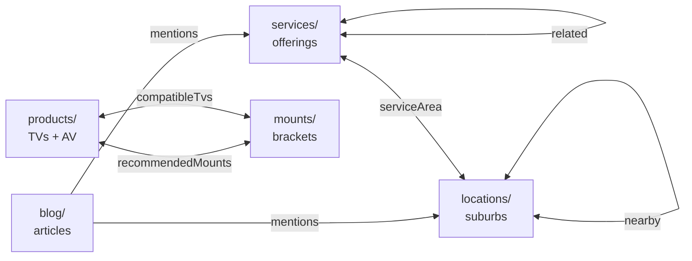
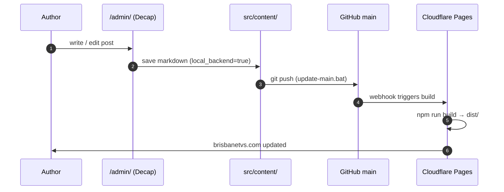

# Brisbane TVs

> The codebase for **[brisbanetvs.com](https://brisbanetvs.com)** — Brisbane's TV
> wall-mounting, cable concealment and home-theatre install service. One static
> homepage, one Astro-powered CMS-driven blog/catalogue, a handful of
> Cloudflare Workers, and a drawer full of Windows `.bat` scripts that glue
> it all together.

<p>
  <a href="https://brisbanetvs.com"></a>
  <a href="#"></a>
  <a href="#"></a>
  <a href="#"></a>
  <a href="#"></a>
  <a href="./LICENSE"></a>
</p>

---

## What this repo is

Two sites stitched together by a shared design system:

1. **Root homepage** — `./index.html`, hand-written single-file HTML/CSS/JS.
   Treat as legacy. Edit in place. Served at `/`.
2. **Astro application** — `./astro/`, the actual app: blog, services,
   locations, products, mounts, pricing, quote, admin dashboard, Decap CMS.
   Statically built to `./astro/dist/` and deployed by Cloudflare Pages.

Both halves import the same `astro/public/css/marketing.css` so header,
footer, typography and colours stay aligned.

---

## Architecture at a glance

```mermaid
graph LR
    subgraph Source[Source]
      direction TB
      RootHTML[index.html<br/>static homepage]
      AstroApp[astro/<br/>pages + layouts + components]
      Collections[astro/src/content/<br/>Zod-validated .md]
      PublicAssets[astro/public/<br/>css / media / admin]
    end

    subgraph Build
      AstroBuild[astro build]
    end

    subgraph Dist[astro/dist/]
      FinalHTML[static HTML + assets]
    end

    subgraph Edge[Edge layer]
      Pages[Cloudflare Pages<br/>brisbanetvs.com]
      ChatW[api/chat.js Worker<br/>/api/chat]
      CmsAuth[cms-auth-worker<br/>Decap OAuth]
    end

    subgraph Editor[Editors]
      CMS[Decap CMS<br/>/admin/]
      AdminNav[/admin-nav/<br/>custom dashboard]
    end

    RootHTML --> AstroBuild
    AstroApp --> AstroBuild
    Collections --> AstroBuild
    PublicAssets --> AstroBuild
    AstroBuild --> FinalHTML
    FinalHTML --> Pages
    Pages -. same-origin .- ChatW
    CMS --> CmsAuth --> Repo[GitHub main]
    Repo --> Pages
    AdminNav --> Pages
```

---

## Tech stack

| Layer          | Choice                                                                      |
|----------------|-----------------------------------------------------------------------------|
| Framework      | [Astro 4.16](https://astro.build) (static output, file-based routing)       |
| Content        | Markdown in `src/content/` with Zod schemas in `content/config.ts`          |
| CMS            | [Decap CMS](https://decapcms.org) at `/admin/`, local proxy on `:8081`      |
| Styling        | Plain CSS design system in `astro/public/css/marketing.css`                 |
| Hosting        | Cloudflare Pages                                                            |
| AI chat        | Cloudflare Worker (`api/chat.js`) → Anthropic Messages API                  |
| Form webhooks  | n8n cloud, routed through `/api/n8n/*`                                      |
| Images         | Hosted on `cdn.brisbanetvs.com`                                             |
| Dev scripts    | Windows `.bat` helpers in `git.tools/`                                      |

---

## Quick start

**Prereqs:** Node 18+ and Git. Windows users can double-click the
`.bat` files; everyone else uses the shell commands.

```bash
git clone https://github.com/PrompDev/brisbanetvs.git
cd brisbanetvs/astro
npm install
npm run dev
# http://localhost:4321
```

Optional — for the `/admin/` editor, run Decap's local proxy in a
second terminal:

```bash
npx decap-server
# now /admin/ writes directly to src/content/ on disk
```

**Windows shortcut:** double-click `git.tools/start-astro-dev.bat`. It
launches both processes and opens the dev server automatically.

---

## Repository map

```
brisbanetvs/
├─ index.html            Root homepage (legacy, hand-written)
├─ css/ img/             Assets referenced by the root homepage only
├─ api/chat.js           Cloudflare Worker — /api/chat (Anthropic)
├─ astro/                Astro application (the actual app)
│  ├─ src/
│  │  ├─ content/        Markdown collections + Zod schemas
│  │  ├─ pages/          File-based routes
│  │  ├─ layouts/        Page + post layouts
│  │  └─ components/     Header, Footer, MobileMenu, ChatWidget, admin/*
│  ├─ public/            Static passthrough (css, media, admin, robots)
│  └─ scripts/           audit-links.mjs post-build check
├─ git.tools/            Windows dev + git helpers
│  ├─ AGENTS.md          ★ agent-to-agent engineering handoff ★
│  ├─ CHANGELOG.log      Auto-appended per-commit diff log
│  └─ *.bat              start-astro-dev, update-main, sync-from-main …
└─ documentation/        Plain-English prose guides (for humans)
```

Full map + rationale: [`git.tools/AGENTS.md`](./git.tools/AGENTS.md).

---

## Content model

Five Zod-validated collections in `astro/src/content/config.ts`.



Every collection emits its own schema.org JSON-LD (Article, Service,
LocalBusiness, Product) from its layout.

Full per-field reference: [`git.tools/AGENTS.md#31-cross-collection-relationships`](./git.tools/AGENTS.md).

---

## Routes

| URL pattern              | Source                                       |
|--------------------------|----------------------------------------------|
| `/`                      | `index.html` (root, static)                  |
| `/blog/`                 | `astro/src/pages/blog/index.astro`           |
| `/blog/<slug>/`          | `astro/src/pages/blog/[...slug].astro`       |
| `/services/`             | `astro/src/pages/services/index.astro`       |
| `/services/<slug>/`      | `astro/src/pages/services/[...slug].astro`   |
| `/locations/`            | `astro/src/pages/locations/index.astro`      |
| `/locations/<slug>/`     | `astro/src/pages/locations/[...slug].astro`  |
| `/products/`             | `astro/src/pages/products/index.astro`       |
| `/products/<slug>/`      | `astro/src/pages/products/[...slug].astro`   |
| `/mounts/`               | `astro/src/pages/mounts/index.astro`         |
| `/mounts/<slug>/`        | `astro/src/pages/mounts/[...slug].astro`     |
| `/pricing/`              | `astro/src/pages/pricing.astro`              |
| `/quote/`                | `astro/src/pages/quote.astro`                |
| `/sitemap.xml`           | `astro/src/pages/sitemap.xml.ts`             |
| `/admin/`                | `astro/public/admin/` (Decap bundle)         |
| `/admin-nav/`            | `astro/src/pages/admin-nav/index.astro`      |

---

## Authoring content

### Write a new blog post

1. Drop a `.md` file in `astro/src/content/blog/` with a kebab-case
   filename (becomes the URL slug).
2. Fill in frontmatter — **every required field** in the `blog` Zod
   schema must be present, or `astro build` fails.
3. Use `IMAGE:name` placeholders in the body if images aren't uploaded
   yet; the bulk uploader at `/admin-nav/blogs/` rewrites them on save.

Required frontmatter:

```yaml
---
title: "8–120 character title"
description: "40–200 character meta description"
heroImage: "https://cdn.brisbanetvs.com/your-image.webp"
heroAlt: "at least 8 characters of alt text"
publishDate: 2026-04-23
style: custom            # standard | service-guide | location | custom
tags: [wall-mounting, brisbane]
draft: false
---
```

### Publishing flow



---

## Build, verify, ship

```bash
cd astro
npm run build                         # → astro/dist/
npm run preview                       # serve dist/ locally
node scripts/audit-links.mjs          # scan dist/ for broken internal links
```

Then push:

- **Windows:** double-click `git.tools/update-main.bat`. It stages,
  auto-commits with timestamp, appends a diff log to
  `git.tools/CHANGELOG.log`, and pushes.
- **Shell:**
  ```bash
  git add -A && git commit -m "…" && git push origin main
  ```

Cloudflare Pages rebuilds automatically on push.

---

## Environment configuration

These are **not** committed to the repo. Set them on the relevant
Cloudflare Worker / Pages project:

| Variable              | Used by                               | Where                    |
|-----------------------|---------------------------------------|--------------------------|
| `ANTHROPIC_API_KEY`   | `api/chat.js`                         | Cloudflare Worker env    |
| GitHub OAuth creds    | `git.tools/cms-auth-worker/`          | Worker secrets           |

Cloudflare Pages build config:

| Setting            | Value                                |
|--------------------|--------------------------------------|
| Build command      | `cd astro && npm install && npm run build` |
| Output directory   | `astro/dist`                         |
| Root directory     | *(repo root)*                        |
| Node version       | `18`                                 |

---

## Documentation

- [**`git.tools/AGENTS.md`**](./git.tools/AGENTS.md) — comprehensive
  agent-to-agent engineering handoff (schema maps, dev flow, deploy,
  landmines). **Start here if you're an AI agent or a new engineer.**
- [`documentation/`](./documentation/) — plain-English prose guides for
  non-engineers (Astro explainer, folder tour, external services, blog
  lifecycle, git tools, glossary, n8n automations).
- [`astro/README.md`](./astro/README.md) — Astro-specific dev notes.

---

## Contributing

Single-branch workflow. Default branch is `main`; there is no PR review
gate. Before you start:

1. `git.tools/sync-from-main.bat` (or `git pull origin main`).
2. Make your change.
3. `cd astro && npm run build` and `node scripts/audit-links.mjs` to
   verify nothing 404s.
4. `git.tools/update-main.bat` (or `git push origin main`).

**Never force-push `main`.** **Never commit secrets.**

The full landmine list — things that have already broken builds — is
in [`git.tools/AGENTS.md § 8`](./git.tools/AGENTS.md).

---

## License

Proprietary — © Brisbane TVs Pty Ltd. All rights reserved.

---

<sub>Built in Brisbane. Mounted to stud.</sub>
