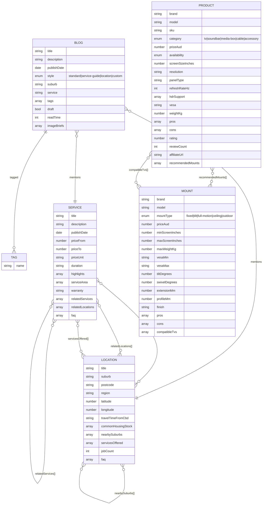
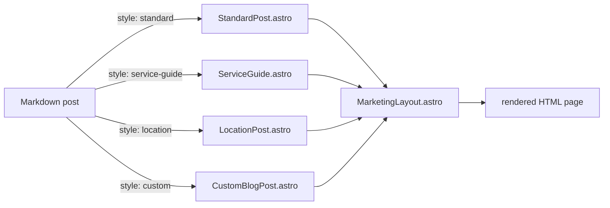
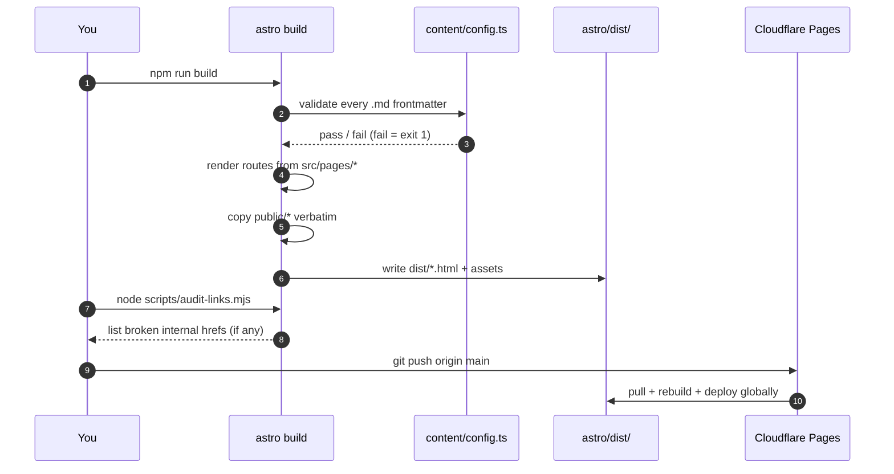
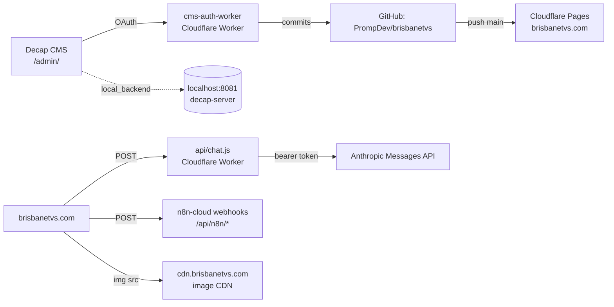
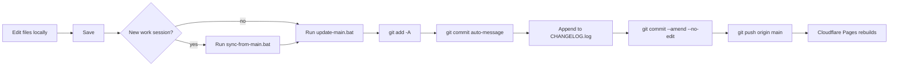

# AGENTS.md — Brisbane TVs engineering handoff

> Agent-to-agent briefing. Read this before you touch anything. It tells you
> what the repo is, how the pieces fit, how to run it locally, how to ship,
> and the landmines that have bitten previous agents.

**Repo:** `https://github.com/PrompDev/brisbanetvs`
**Deploy target:** Cloudflare Pages → `brisbanetvs.com`
**Default branch:** `main`
**Runtime:** Node 18+ (LTS), Astro 4.16
**Canonical working directory for Astro work:** `./astro`

---

## 1. 30-second mental model

The repo is **two sites glued together** by a shared design language:

1. **Hand-written static homepage** — the file `./index.html` at the repo
   root. It is ~290 KB of one-file HTML/CSS/JS. It is NOT produced by Astro.
   It is served at `/`. Treat it like a legacy file — edits go directly into
   the HTML.
2. **Astro-generated everything else** — `/blog/*`, `/services/*`,
   `/locations/*`, `/products/*`, `/mounts/*`, `/pricing`, `/quote`, and the
   `/admin/` + `/admin-nav/` editor. Lives in `./astro/`. Builds into
   `./astro/dist/`.

Both halves share `./astro/public/css/marketing.css` so the header, footer,
typography, and colors match.

Build pipeline (conceptual):

```
┌──────────────────┐   ┌──────────────────┐   ┌──────────────────┐
│ index.html       │   │ Astro pages +    │   │ astro/public/*   │
│ (root, static)   │   │ content coll'ns  │   │ (assets, admin)  │
└────────┬─────────┘   └────────┬─────────┘   └────────┬─────────┘
         │                      │                      │
         │                      ▼                      │
         │            ┌─────────────────┐              │
         │            │ npm run build   │              │
         │            │ astro build     │              │
         │            └────────┬────────┘              │
         │                     │                       │
         ▼                     ▼                       ▼
    ┌────────────────────────────────────────────────────┐
    │  astro/dist/  (final static site, Cloudflare root) │
    └────────────────────────────────────────────────────┘
```

---

## 2. Repository map

```
Brisbane TVs/
├─ index.html                 LEGACY root homepage (do NOT move into Astro)
├─ css/                       Legacy CSS only referenced by root homepage
├─ img/                       Legacy homepage images
├─ api/chat.js                Cloudflare Worker source for AI chat endpoint
├─ astro/                     ★ The actual application ★
│  ├─ astro.config.mjs        site URL + integrations
│  ├─ package.json            Astro + a11y + sitemap deps
│  ├─ tsconfig.json           ~/* alias → src/*
│  ├─ public/                 static passthrough (css, media, admin, robots)
│  │  ├─ css/marketing.css    shared design system (both sites use it)
│  │  ├─ admin/config.yml     Decap CMS collection schema
│  │  ├─ media/               CMS-uploaded images
│  │  ├─ index.html           copy of root homepage, published at /
│  │  └─ robots.txt
│  ├─ scripts/
│  │  └─ audit-links.mjs      post-build internal-link checker
│  └─ src/
│     ├─ components/          Header, Footer, MobileMenu, ChatWidget, admin/*
│     ├─ content/
│     │  ├─ config.ts         ★ Zod schemas for ALL 5 collections ★
│     │  ├─ blog/             .md posts
│     │  ├─ services/         .md service pages
│     │  ├─ locations/        .md suburb pages
│     │  ├─ products/         .md TV/AV product pages
│     │  └─ mounts/           .md mount product pages
│     ├─ layouts/             MarketingLayout + per-collection post layouts
│     ├─ pages/               file-based routes (see §5)
│     └─ styles/              any additional SCSS/CSS imported by components
├─ git.tools/                 ★ Windows .bat helpers + this file ★
│  ├─ AGENTS.md               ← you are here
│  ├─ CHANGELOG.log           auto-appended by update-main.bat
│  ├─ start-astro-dev.bat     launch Astro + Decap proxy
│  ├─ start-dev-server.bat    legacy live-server for root homepage only
│  ├─ sync-from-main.bat      git fetch + pull
│  ├─ update-main.bat         git add + commit + push + changelog
│  └─ cms-auth-worker/        Cloudflare Worker OAuth proxy for Decap
├─ documentation/             plain-English prose docs (for humans)
├─ blog/                      legacy flat-HTML blog exports (archive; ignore)
└─ blank template/            reference-only starter; do not edit
```

**Canonical source of truth table**

| Concern                       | File                                                   |
|-------------------------------|--------------------------------------------------------|
| Root homepage                 | `./index.html`                                         |
| Shared design tokens/CSS      | `./astro/public/css/marketing.css`                     |
| Content collection schemas    | `./astro/src/content/config.ts`                        |
| Decap CMS editor config       | `./astro/public/admin/config.yml`                      |
| Site URL + build config       | `./astro/astro.config.mjs`                             |
| Cloudflare AI chat endpoint   | `./api/chat.js`                                        |
| GitHub OAuth proxy for CMS    | `./git.tools/cms-auth-worker/`                         |

---

## 3. Content model — schema maps

All collections are declared in `astro/src/content/config.ts` with Zod.
Every collection emits its own JSON-LD inside its layout (Service, Product,
LocalBusiness, Article — schema.org types). Reference these maps before
adding or editing fields.

### 3.1 Cross-collection relationships



### 3.2 Layout routing for blog `style` field

The blog `style` field chooses which layout renders the post body. It is
NOT called `layout` — that name is reserved by Astro's Markdown integration
and tries to module-import it. Always use `style`.



### 3.3 Layout inheritance for every surface

```mermaid
graph TD
    BL[BaseLayout.astro<br/>html/head shell] --> ML[MarketingLayout.astro<br/>Header + Footer + ChatWidget]
    ML --> SP[ServicePage.astro]
    ML --> LP[LocationPage.astro]
    ML --> PP[ProductPage.astro]
    ML --> MP[MountPage.astro]
    ML --> Idx1[services/index.astro]
    ML --> Idx2[locations/index.astro]
    ML --> Idx3[products/index.astro]
    ML --> Idx4[mounts/index.astro]
    ML --> Blog[blog/index.astro]
    ML --> Price[pricing.astro]
    ML --> Quote[quote.astro]
    ML --> Post[blog/[...slug].astro]
    Post --> SPo[StandardPost.astro]
    Post --> SGu[ServiceGuide.astro]
    Post --> LPo[LocationPost.astro]
    Post --> CBP[CustomBlogPost.astro]
    AS[AdminShell.astro] --> A1[admin-nav/index.astro]
    AS --> A2[admin-nav/blogs/*]
    AS --> A3[admin-nav/services/*]
    AS --> A4[admin-nav/locations/*]
    AS --> A5[admin-nav/products/*]
    AS --> A6[admin-nav/mounts/*]
    AS --> A7[admin-nav/styles/*]
```

---

## 4. Local dev — how to actually launch it

### The easy way (Windows)

Double-click **`git.tools/start-astro-dev.bat`**. It:

1. Finds Node even if Explorer's PATH is stale (checks PATH → common
   install dirs → `NVM_SYMLINK` → Windows registry).
2. Runs `npm install` in `./astro` the first time.
3. Launches **`npx decap-server`** in a second terminal window (port 8081).
   Decap CMS auto-detects this and writes content changes directly to disk
   instead of routing through GitHub OAuth.
4. Runs `npm run dev` → Astro on `http://localhost:4321`.

When you close it, **close both terminal windows** (the Decap proxy does
not stop automatically).

### The manual way (macOS / Linux / CI)

```bash
cd astro
npm install
# Terminal 1 — Decap local proxy (optional, only needed for /admin/ editor)
npx decap-server
# Terminal 2 — Astro dev server with hot reload
npm run dev
```

Routes you'll care about while developing:

| URL                                    | What it is                           |
|----------------------------------------|--------------------------------------|
| `http://localhost:4321/`               | root homepage (copy of index.html)   |
| `http://localhost:4321/blog/`          | blog index (Astro)                   |
| `http://localhost:4321/blog/<slug>/`   | rendered post                        |
| `http://localhost:4321/services/`      | services hub                         |
| `http://localhost:4321/admin/`         | Decap CMS editor                     |
| `http://localhost:4321/admin-nav/`     | custom admin dashboard               |

Hot reload: any `.astro`, `.md`, or file in `src/` saves and refreshes.
Changes to `public/` are served fresh on next request.

### Build for production + verify

```bash
cd astro
npm run build                   # → astro/dist/
npm run preview                 # serves dist/ at :4321 for local smoke test
node scripts/audit-links.mjs    # crawl dist/ for broken internal hrefs
```

Build flow:



---

## 5. Pages & routing

Astro uses **file-based routing**: every file in `src/pages/` is a URL.
Dynamic segments use `[bracket]` filenames; content-collection routes use
`getStaticPaths()` + `getCollection()`.

| Source file                                 | Published URL                          |
|---------------------------------------------|----------------------------------------|
| `src/pages/index.astro`                     | `/` (stub — redirects / no-op; root `index.html` in `public/` is the real homepage) |
| `src/pages/blog/index.astro`                | `/blog/`                               |
| `src/pages/blog/[...slug].astro`            | `/blog/<post>/`                        |
| `src/pages/services/index.astro`            | `/services/`                           |
| `src/pages/services/[...slug].astro`        | `/services/<service>/`                 |
| `src/pages/locations/index.astro`           | `/locations/`                          |
| `src/pages/locations/[...slug].astro`       | `/locations/<suburb>/`                 |
| `src/pages/products/index.astro`            | `/products/`                           |
| `src/pages/products/[...slug].astro`        | `/products/<sku-or-slug>/`             |
| `src/pages/mounts/index.astro`              | `/mounts/`                             |
| `src/pages/mounts/[...slug].astro`          | `/mounts/<sku-or-slug>/`               |
| `src/pages/pricing.astro`                   | `/pricing/`                            |
| `src/pages/quote.astro`                     | `/quote/`                              |
| `src/pages/sitemap.xml.ts`                  | `/sitemap.xml`                         |
| `src/pages/admin-nav/**`                    | `/admin-nav/**` — editor dashboard     |
| `src/pages/admin/index.astro`               | `/admin/` — redirect → Decap bundle    |

The Decap CMS bundle itself lives in `public/admin/index.html` and is
served verbatim (Astro does not touch it).

---

## 6. External integrations



Integration inventory:

- **Cloudflare Pages** — production hosting. Watches `main`, builds with
  `cd astro && npm run build`, publishes `astro/dist/`.
- **Decap CMS** — browser editor at `/admin/`. Two modes:
  - **Local dev**: `local_backend: true` in `config.yml` makes Decap talk
    to `localhost:8081` (`npx decap-server`) and write to disk.
  - **Production**: GitHub backend with OAuth — the worker at
    `git.tools/cms-auth-worker/` is the auth proxy. The repo in
    `config.yml` must be replaced from the placeholder
    `your-github-user/brisbanetvs` to `PrompDev/brisbanetvs`.
- **AI chat worker** — `./api/chat.js`. Deploy as a Cloudflare Worker,
  route `brisbanetvs.com/api/chat`, env var `ANTHROPIC_API_KEY`.
- **n8n** — webhooks under `/api/n8n/*` handle form submits. Treated as
  runtime-only by `scripts/audit-links.mjs` (never flagged as 404).
- **Image CDN** — `cdn.brisbanetvs.com`. All hero/in-body images reference
  this origin, not `/public/`. Uploads to CDN are out of repo.

---

## 7. Git workflow

The **single allowed pattern** on this repo:



Rules for agents:

1. **Always run `sync-from-main.bat` before starting new work** unless you
   know no one else has pushed. This repo goes straight to `main`, there's
   no branching convention.
2. **Commit with `update-main.bat`** — it stages everything, auto-generates
   a timestamped commit message, writes a per-file line+character diff
   into `CHANGELOG.log`, amends the log into the commit, then pushes.
3. **Never force-push to `main`.** There is no review gate; force-push
   destroys history for every other contributor.
4. **Never commit `astro/node_modules/` or `astro/dist/`.** `.gitignore`
   already excludes them, but double-check if you see them staged —
   something's wrong with ignore rules.
5. **Secrets never hit git.** `ANTHROPIC_API_KEY` lives in Cloudflare
   Worker env vars, nowhere else. `cms-auth-worker` OAuth secrets live
   in `wrangler.toml` secrets, not the file itself.
6. **`CHANGELOG.log` is the allow-listed log file** — `.gitignore` ignores
   `*.log` but explicitly re-includes `!git.tools/CHANGELOG.log`. Don't
   add other `.log` files expecting them to track.

---

## 8. Known gotchas (aka "things that have already bitten us")

Before you think you've found a bug, check this list. Every one of these
has caused a PR cycle already.

**Astro / content**

- **`layout:` in blog frontmatter** is a reserved Astro keyword that tries
  to module-import its value. This collection uses `style:` instead.
  Never rename it back to `layout`.
- **`@astrojs/sitemap`** was removed because its `build:done` hook threw
  `Cannot read properties of undefined (reading 'reduce')` on admin-nav
  redirect routes. Sitemap is hand-rolled via `src/pages/sitemap.xml.ts`.
  Don't re-add the integration without fixing that.
- **`astro build` exits non-zero** if ANY `.md` frontmatter fails Zod
  validation. If Cloudflare Pages deploy fails with exit 1, it's almost
  always a frontmatter field missing or out-of-range — check the log for
  the filename.
- Default paper/margin in docx-js is A4. Irrelevant here but listed for
  agents who spin into doc generation tasks.

**CSS / layout**

- `html` and `body` must be split when setting `overflow-x: hidden`, or
  the implicit `overflow-y: auto` creates a second scroll container. See
  the comment at the top of `public/css/marketing.css` and the same fix
  inside `public/index.html`.
- Mobile menu scroll-lock needs `html:has(body.menu-open) { overflow: hidden }`
  when `html` is the scroll container. `body.menu-open { overflow: hidden }`
  alone is insufficient.
- Root homepage (`index.html`) has its own inline CSS copy of the design
  system. Fixes to marketing.css that affect layout probably need to be
  applied **in both places**.

**Decap CMS**

- `editorial_workflow` breaks when combined with `local_backend: true` —
  saves fail silently. Kept off for local; flip on only in production
  config.
- The placeholder `repo: your-github-user/brisbanetvs` in
  `public/admin/config.yml` will 404 against the GitHub backend. Replace
  to `PrompDev/brisbanetvs` before pushing to production.

**Dev scripts**

- `start-astro-dev.bat` will NOT stop `npx decap-server` when you close
  the Astro terminal — close both windows manually.
- `update-main.bat` assumes `origin main` exists. If push fails, run
  `sync-from-main.bat` first and try again.

---

## 9. Common agent tasks — how to do them

### Add a new blog post

1. Create `astro/src/content/blog/<kebab-slug>.md`.
2. Frontmatter MUST match the `blog` Zod schema (title 8–120 chars,
   description 40–200, `publishDate`, `heroImage`, `heroAlt` ≥ 8 chars,
   `style` from the enum).
3. Use `IMAGE:placeholder` tokens in body if images aren't ready — the
   bulk uploader (`/admin-nav/blogs/`) rewrites them on save.
4. `npm run build` to validate.

### Add a new service/location/product/mount page

Same pattern — drop a `.md` in the matching collection folder, frontmatter
must pass the corresponding Zod schema in `content/config.ts`. The layout
(e.g. `ServicePage.astro`) picks up the content automatically because
`src/pages/<collection>/[...slug].astro` calls `getCollection()`.

### Change shared design tokens

Edit **`astro/public/css/marketing.css`**. If the change affects layout or
header styling, also mirror the fix into `index.html`'s inline `<style>`
block. Rebuild and visually confirm both `/` and at least one Astro page.

### Verify a build before pushing

```bash
cd astro
npm run build
node scripts/audit-links.mjs    # catches 404s in internal links
```

Then push with `update-main.bat`.

### Add a new content collection

1. Declare the Zod schema in `src/content/config.ts` and add it to the
   `collections` export.
2. Create `src/content/<name>/` folder.
3. Create `src/pages/<name>/index.astro` (hub) and
   `src/pages/<name>/[...slug].astro` (detail) — mirror the patterns used
   by `services`.
4. Create a layout component under `src/layouts/`.
5. Add the collection to `public/admin/config.yml` so Decap can edit it.

---

## 10. File-level responsibilities cheat sheet

| File                                           | Owns                                       |
|------------------------------------------------|--------------------------------------------|
| `astro/src/content/config.ts`                  | All content schemas (Zod)                  |
| `astro/src/layouts/MarketingLayout.astro`      | Marketing header/footer shell              |
| `astro/src/layouts/BaseLayout.astro`           | `<html>`/`<head>` skeleton + meta          |
| `astro/src/components/Header.astro`            | Top nav, mega menu, mobile hamburger       |
| `astro/src/components/Footer.astro`            | Global footer + signup form                |
| `astro/src/components/ChatWidget.astro`        | Floating AI chat UI                        |
| `astro/public/css/marketing.css`               | Design tokens, shared classes, .blog-*, .idx-* |
| `astro/public/admin/config.yml`                | Decap CMS editor config                    |
| `astro/astro.config.mjs`                       | `site` URL, integrations, build format     |
| `astro/scripts/audit-links.mjs`                | Post-build internal-link audit             |
| `index.html` (root)                            | Hand-written homepage, served at `/`       |
| `api/chat.js`                                  | Cloudflare Worker for AI chat              |
| `git.tools/cms-auth-worker/`                   | Cloudflare Worker: Decap GitHub OAuth      |
| `git.tools/*.bat`                              | Windows dev + git helpers                  |
| `git.tools/CHANGELOG.log`                      | Auto-generated per-commit diff log         |

---

## 11. When to escalate vs. self-serve

**Self-serve** (edit + push without asking):

- Copy tweaks, typos, image swaps in existing `.md`/`.astro`.
- New blog posts, services, locations, products, mounts that pass Zod.
- CSS tweaks that don't change shared tokens.
- Updates to internal docs (this file, `documentation/*`).

**Ask first** (don't silently change):

- Renaming or removing a field in `content/config.ts` — breaks every
  existing `.md` in that collection.
- Touching `astro.config.mjs`, `tsconfig.json`, or `package.json`.
- Changing the Decap CMS `repo:` or `base_url:` in production config.
- Force-pushing, rebasing, or rewriting `main` history.
- Bumping Astro major version.

---

_Last revised: 2026-04-23 · Keep this file current. When you change a
schema, add a layout, or hit a new gotcha, update the relevant section._
